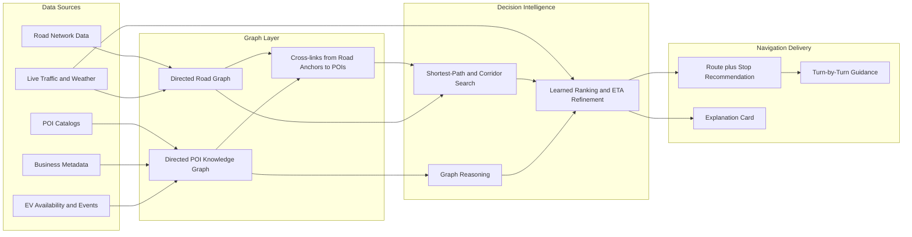
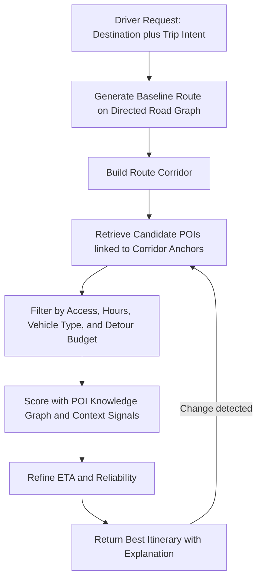
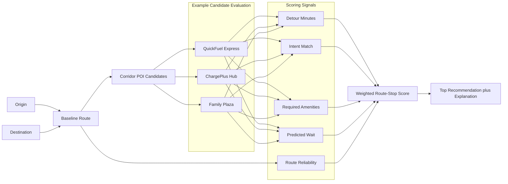

# Proposal: Graph-Based Navigation System for POI-Aware Vehicle Routing

## 1. Executive Summary

This proposal outlines a graph-based enhancement to a standard in-car navigation system, such as a Garmin-style product, by adding a knowledge-graph layer for points of interest (POIs) on top of the conventional road-network graph. The goal is to move beyond shortest-path navigation toward intent-aware, context-aware, and explainable routing.

In the proposed system, roads remain the operational routing graph, while POIs, user intents, contextual signals, and service relationships are modeled as a directed knowledge graph. The navigation engine can then answer questions that traditional systems handle poorly, such as:

- Which route best matches a driver who needs fuel within 15 minutes, prefers low detours, and values highly rated stations with open restrooms?
- Which charging stop sequence is most robust for an EV under uncertain queue times and weather?
- Which route should be recommended for a tourist who values scenic, family-friendly stops over pure ETA minimization?

The core idea is not to replace shortest-path algorithms, but to augment them with graph reasoning, learned ranking, and dynamic context fusion. Recent research supports this direction across next-POI recommendation, route recommendation, travel-time prediction, graph-based map matching, and graph neural networks for transportation systems [1][2][3][4][5][6][7].

## 2. Problem Statement

Conventional automotive navigation systems are strong at:

- turn-by-turn guidance
- shortest or fastest path search
- static POI lookup
- reactive rerouting after congestion is observed

They are weaker at:

- modeling semantic relationships among POIs
- tailoring recommendations to trip purpose and driver preferences
- reasoning over temporal context such as opening hours, queue likelihood, or event-driven demand
- balancing route efficiency with stop quality, safety, convenience, and robustness
- explaining why one detour or stop sequence is better than another

This gap is important because modern navigation is no longer just path computation. It is trip planning under context, preference, and uncertainty.

## 3. Proposed System

### 3.1 Design Principle

Use a dual-graph architecture:

- A road graph for operational routing.
- A POI knowledge graph for semantic reasoning and recommendation.

The road graph answers: how do I get there?

The knowledge graph answers: what should I stop for, when, and why?

Figure 1 shows the proposed dual-graph architecture and how static data, live context, routing, and ranking work together.

The system is designed to be modular, so that the road graph can be updated independently of the knowledge graph, and the ranking model can be improved without changing the underlying routing algorithms.

### 3.2 Graph Model

#### Road Graph

Nodes:

- intersections
- lane groups or road segments
- charging stations, parking facilities, service areas, toll booths as routable anchors

Directed edges:

- legal travel transitions
- turn restrictions
- time-dependent travel costs
- road class, safety, toll, and weather sensitivity attributes

#### POI Knowledge Graph

Nodes:

- POIs: gas stations, EV chargers, restaurants, parking, hospitals, hotels, attractions
- brands and chains
- amenities: restroom, wheelchair access, food type, child-friendly, covered parking
- user profiles and trip intents
- regions, districts, road corridors, and event zones
- contextual entities: weather states, time windows, holidays, traffic regimes

Directed edges:

- `near_to`
- `accessible_from`
- `belongs_to_brand`
- `offers_amenity`
- `preferred_by_segment`
- `busy_during`
- `compatible_with_vehicle_type`
- `requires_membership`
- `alternative_to`
- `part_of_trip_pattern`

This directed structure is important because many relations are not symmetric. For example, a POI may be accessible from a highway exit but not easily re-enterable in the reverse direction, and an amenity may be relevant only under specific trip conditions.

### 3.3 Core Capabilities

1. Intent-aware POI ranking

The system ranks POIs not only by distance but by semantic fit to the trip. For example, “best quick breakfast stop with low detour and easy parking” becomes a graph query plus learned ranking problem.

2. Multi-objective route planning

The route scorer optimizes ETA, detour cost, POI quality, reliability, safety, and user preference weights.

3. Trip-chain recommendation

Instead of recommending a single stop, the system proposes sequences such as fuel plus food plus restroom, or charger plus café plus shaded parking.

4. Context-sensitive rerouting

When traffic or POI state changes, the engine can rerank both roads and stops together rather than treating rerouting and POI search as separate subsystems.

5. Explainable navigation

The system can produce human-readable reasons such as: “Recommended because this charger is directly on your corridor, has lower historical wait, and is adjacent to a restroom and café.”

## 4. Technical Architecture

### 4.1 System Components

1. Ingestion layer

- road network data
- POI catalogs

2. Graph construction layer

- build the directed road and POI graph
- create cross-links from routable road anchors to semantic POI nodes

3. Feature and embedding layer

- graph embeddings for POIs and trip contexts
- spatio-temporal features for road segments and demand states

4. Decision layer

- candidate route generation using standard shortest-path variants and POI generation along route corridors
- graph-based reasoning and ranking over route-stop combinations

5. Delivery layer

- on-device turn guidance
- cloud-assisted ranking and inference when connectivity exists

Figure 2 summarizes the end-to-end application flow from a driver request to a recommended itinerary.

The system is to be tested in a simulated environment with synthetic and real-world data, and then deployed in a limited field trial before full production.

### 4.2 Algorithmic Approach

The practical approach is hybrid rather than purely symbolic or purely learned.

#### Layer A: Deterministic routing

Use established path-finding algorithms for safety-critical and low-latency path generation.

#### Layer B: Knowledge-graph reasoning

Use graph traversal, path constraints, and relation-aware scoring to identify semantically valid stop candidates.

#### Layer C: Learned ranking

Use graph neural networks or knowledge-graph-aware recommenders to rank POIs and route-stop bundles. This is consistent with recent work showing the effectiveness of temporal and multimodal knowledge-graph reasoning for next-POI recommendation [1][2][3][4].

#### Layer D: Traffic and ETA prediction

Use spatio-temporal graph models to refine edge weights and improve dynamic route scoring. This direction is strongly supported by graph-neural-network research for transportation and traffic prediction [5][6][8][9].

Figure 3 gives a concrete example of how the scoring pipeline works for a single recommendation decision.

## 5. Why a Knowledge Graph Is the Right Abstraction

Compared with a flat POI database, a knowledge graph provides:

- relation modeling: POIs can be linked to amenities, brands, usage patterns, restrictions, and contexts
- explainability: route and stop recommendations can be traced through explicit relations
- compositional reasoning: the system can answer compound needs such as “EV charger near playground with food, open after 9 PM”
- extensibility: new entity types such as curbside pickup, low-emission zones, and membership-only charging can be added without redesigning the whole schema
- personalization: user and trip-profile nodes can connect to POI and corridor preferences

For an automotive product, this is a better long-term abstraction than repeatedly adding special-purpose ranking rules.

## 6. Proposed Product Scenarios

### 6.1 Commuter Navigation

Recommend routes that trade off ETA against reliability, safer intersections, parking availability near destination, and preferred fuel or coffee stops.

### 6.2 Long-Distance Family Travel

Find stop sequences with clean restrooms, child-friendly food, safe ingress and egress, and low detour burden.

### 6.3 EV Navigation

Integrate charger compatibility, expected occupancy, charging speed, nearby amenities, and confidence-aware backup alternatives.

### 6.4 Tourism and Leisure

Suggest scenic or thematic detours, local attractions, and clustered destination sequences rather than isolated POIs.

### 6.5 Fleet and Professional Driving

Optimize for service-level constraints such as truck restrictions, refueling policy, parking suitability, safety windows, and predictable stop turnaround.

## 7. Research Basis

The proposal aligns with several active research directions:

- Knowledge-graph-aware POI recommendation is becoming more temporal, multimodal, and context-aware, as seen in Mandari, CTKGRec, M4Rec, and task-aware meta-learning approaches [1][2][3][4].
- Learned route recommendation has moved beyond static heuristics toward neural and reliability-aware methods, including personalized route recommendation and robust route models on road networks [7][10].
- Traffic and ETA estimation now commonly rely on graph neural networks over road-network structure, including production-oriented work such as ETA prediction with graph neural networks in Google Maps and broader intelligent transportation surveys [5][6][8][9].
- Graph-based map matching and road-correlation modeling can improve the linkage between noisy trajectories and the road graph, which is critical for training and live inference [11].

Together, these lines of work suggest that a commercial navigation system can benefit from a layered graph architecture where:

- symbolic graphs provide structure and explainability
- learned graph models provide ranking and prediction
- conventional routing algorithms preserve safety, determinism, and latency guarantees

## 8. Recommended MVP

### 8.1 Scope

Build an MVP for one metropolitan region with three trip intents:

- fuel stop
- EV charging stop
- family rest stop

### 8.2 MVP Features

1. Route-corridor POI recommendation

Rank POIs along a planned route using detour cost, availability, opening hours, ratings, and amenity fit.

2. Context-aware stop suggestions

Adjust ranking by time of day, live traffic, weather, and historical demand.

3. Explainable recommendation card

Display why a stop is recommended.

4. Fallback mode

If live context is unavailable, degrade gracefully to static graph features and deterministic route search.

### 8.3 MVP Success Metrics

- increase in accepted POI recommendations
- reduction in manual POI searches during navigation
- lower detour dissatisfaction rate
- improved trip completion confidence for EV journeys
- stable latency for route recomputation and stop reranking

## 9. Implementation Roadmap

### Phase 1: Data Foundation

- define ontology for POIs, amenities, intents, and context
- ingest map and POI sources
- map POIs to routable anchors on the road graph
- establish data quality checks for duplicates, stale hours, and access-direction errors

### Phase 2: Baseline Graph Reasoning

- implement candidate retrieval along route corridors
- define rule-based multi-objective scoring
- ship explainable stop recommendations without machine learning dependency

### Phase 3: Learned Ranking

- train a knowledge-graph-aware ranking model for POI selection
- add user-segment and trip-intent personalization
- evaluate offline with counterfactual replay and online with A/B tests

### Phase 4: Dynamic Mobility Intelligence

- integrate graph-based ETA and traffic prediction
- incorporate occupancy forecasts for parking and EV chargers
- support proactive rerouting and stop resequencing

### Phase 5: Full Productization

- edge-cloud partitioning
- privacy-preserving telemetry
- regional ontology extension
- multilingual explanation generation

## 10. Key Risks and Mitigations

### Data Freshness Risk

POI state changes quickly. Opening hours, charger status, and congestion can go stale.

Mitigation: separate static facts from volatile state, assign confidence scores, and prefer providers with live operational feeds.

### Explainability Risk

Users may reject recommendations that appear arbitrary.

Mitigation: expose the top contributing factors behind every stop suggestion and detour recommendation.

### Latency Risk

Joint routing and POI reasoning can become expensive.

Mitigation: generate narrow route corridors first, then rank only a bounded candidate set.

### Privacy Risk

Trip history is sensitive.

Mitigation: keep user embeddings anonymized, minimize retention, and support opt-in personalization.

### Cold-Start Risk

New regions and new users may lack enough interaction data.

Mitigation: begin with graph rules plus global priors, then adapt with observed usage.

## 11. Recommendation

The recommended strategy is to treat graph-based navigation as an augmentation layer over existing navigation, not as a full replacement. That makes the system commercially realistic:

- preserve mature road-routing infrastructure
- add a POI knowledge graph for semantic trip planning
- use graph learning only where it clearly improves ranking, prediction, or robustness

This is the lowest-risk path to a differentiated navigation product. It offers a credible product advantage in EV routing, family travel, urban convenience, and explainable POI recommendation while staying compatible with established embedded-navigation constraints.

## 12. References

[1] Liu, Y., Li, Z., Chen, Z., et al. Mandari: Multi-Modal Temporal Knowledge Graph-aware Sub-graph Embedding for Next-POI Recommendation. ICME, 2023. DBLP: https://dblp.org/rec/conf/icmcs/LiuLCZJC23

[2] Pan, X., Zhang, Z., Zhou, Y., et al. CTKGRec: A context-aware temporal knowledge graph reasoning model for next POI recommendation. Expert Systems with Applications, 2026. DBLP: https://dblp.org/rec/journals/eswa/PanZZKSZ26

[3] Chen, X., Zhang, Y., Li, J., et al. M4Rec: Multi-Modal Knowledge Graph Modeling of Multi-Dimensional User Preferences for Next-POI Recommendation. IEEE Transactions on Knowledge and Data Engineering, 2026. DBLP: https://dblp.org/rec/journals/tkde/ChenZLLWWJ26

[4] Wang, Y., Wang, J., Li, Q., et al. Task-Aware Meta-Learning on Heterogeneous Knowledge Graph for POI Recommendation. AAAI, 2026. DBLP: https://dblp.org/rec/conf/aaai/WangWLG26

[5] Wang, X., et al. Graph Neural Networks for Intelligent Transportation Systems: A Survey. IEEE Transactions on Intelligent Transportation Systems, 2023. DOI: https://doi.org/10.1109/TITS.2023.3257759

[6] Ke, J., Shen, X., et al. ETA Prediction with Graph Neural Networks in Google Maps. KDD, 2021. DOI: https://doi.org/10.1145/3459637.3481916

[7] Yang, C., et al. Personalized Route Recommendation With Neural Network Enhanced Search Algorithm. IEEE Transactions on Knowledge and Data Engineering, 2021. DOI: https://doi.org/10.1109/TKDE.2021.3068479

[8] Li, J., Han, Y., et al. MCAGCN: Multi-component attention graph convolutional neural network for road travel time prediction. IET Intelligent Transport Systems, 2023. DOI: https://doi.org/10.1049/itr2.12440

[9] Jin, M., et al. Decoupled dynamic spatial-temporal graph neural network for traffic forecasting. Proceedings of the VLDB Endowment, 2022. DOI: https://doi.org/10.14778/3551793.3551827

[10] Wang, H., et al. NeuroMLR: Robust & Reliable Route Recommendation on Road Networks. NeurIPS, 2021. OpenAlex-listed conference record.

[11] Xu, Z., et al. GraphMM: Graph-Based Vehicular Map Matching by Leveraging Trajectory and Road Correlations. IEEE Transactions on Knowledge and Data Engineering, 2023. DOI: https://doi.org/10.1109/TKDE.2023.3287739
